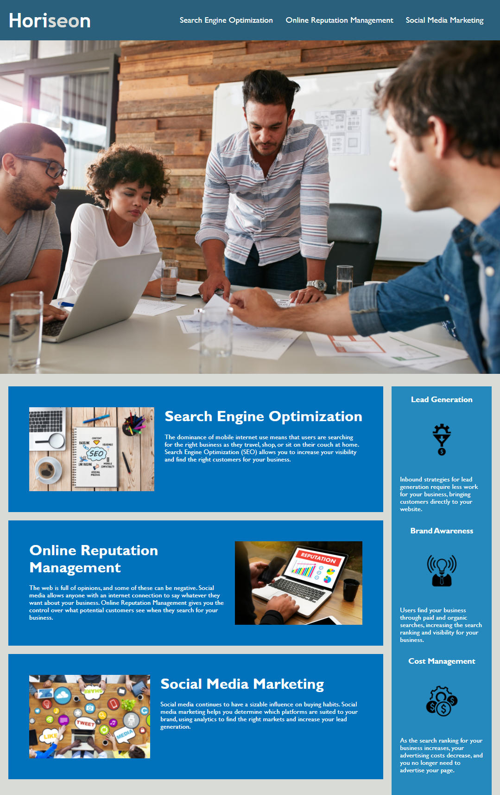

# homework1-accessibility
Enhancing code to improve accessibility compliance and optimize for search engines

## Task
We have been hired by a marketing agency and asked to refactor some existing code to meet web accessibility best practices. We have been given specific criteria for this, and as a bonus we have an opportunity to improve the codebase.

## Project Work
My live website can be found [here](https://benfok.github.io/homework1-accessibility/)

My file repository in GitHub is [here](https://github.com/benfok/homework1-accessibility/)

## Screenshot
Here is a screenshot of my finished page. Change log is below:

## Change Log
I adjusted the following within the files and file structure:

- Replaced div=header with header tag
- Replaced div for navigation with nav tags, removing <ul> and <li> tags
- Replaced div hero with figure tags. 
- Converted hero image from a background image in css to an img pulled in HTML in order to add alt description and match the original proof
- Added in <main> tags for semantic HTML
- Converted primary content divs to a section and article tags. I did some research on this and appreciate that this could have instead been 3 sections. Each section does stand alone though with a header, image and information so article tags felt appropriate.
- Convert right sidebar to aside tags with articles contained
- Convert div footer to footer tags
- Update all img tags to pull from my file structure 
- Add alt text to all images
- Added id tag for first content block to fix broken nav link
- Added title for webpage
- Fixed HTML indentation
- Commented out the footer in HTML and CSS because it did not exist within the proof image. I left the code for easy reactivation if needed.
- Consolidated redundant CSS classes to reduce the overall amount of contained
- Rearranged CSS file
- Added comments to the index.html file
